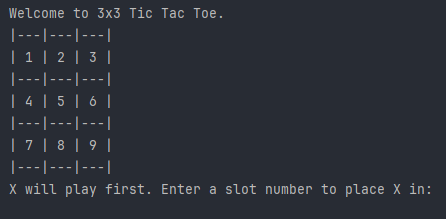
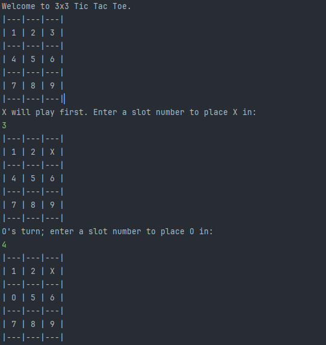

# Tic-Tac-Toe

A simple command-line **Tic Tac Toe** game written in **Java**.

This project is a beginner-friendly implementation demonstrating the use of:
- Loops
- Conditional statements
- Switch-case
- Methods
- Arrays
- User input handling with Scanner

---

## How to Play:
- The game is played by two players taking turns.
- Player **X** always goes first.
- Enter a number between **1-9** to select the position on the board.
- The board positions are as follows:

- The game ends when:
  - A player wins by making a straight line (horizontal, vertical, or diagonal).
  - The board is full, resulting in a **draw**.

---

## Example Run:



---

## Features:
- Input validation (handles invalid inputs and already taken positions)
- Displays updated board after each move
- Declares the winner or a draw

---

## Getting Started

### Compile the Program
```bash
javac TicTacToe.java

java TicTacToe
```
- Clone this repository and run the project in any Java IDE of your choice (such as IntelliJ IDEA, Eclipse, or VS Code).
---

## Author:
Arnim Taliyan  
*For learning & practice purposes*

---

## License:
This project is open-source and free to use for educational purposes.
